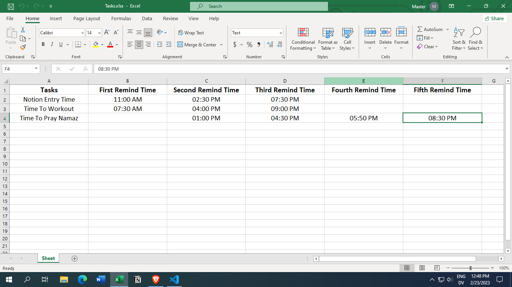

# Tasks Reminder
## Description:
Assalamualaikum World!

This is my Python project. I created this application to remind me of a task.

----

## How to use this application
First we need **Python** to run this application obviously!!!. When we run the application it will create an Excel workbook named **Tasks.xlsx** in that same folder where the application exists. We will write our tasks and times (when to remind) in that workbook and save it.

The image of the workbook

Since this is a reminder app it should run in the background. To run an application in the background, we will need a tool that will automatically run the application in the background.

For now, I only know about two tools that will run an application automatically in the background. In windows, we can use **Task Scheduler** and in macOS or linux we can use **cronjob**.

---

## Requirements
To create this application we will need these modules

* openpyxl
* openpyxl.styles
* notifypy
* time
* os

We can install these modules using "pip install module name"

---

## Functions used in this application
### main():
This function will contain all of our functions. It will check if **Tasks.xlsx** exist or not in that same folder where the application exists. It will check using **os.path.isfile()** method. If **Tasks.xlsx** doesn't exist then it will call **create_workbook()** function. If **Tasks.xlsx** exists then it will loop through every row in **Tasks.xlsx** and will call **remind()** function and put two arguments, **row[0]** which is the task name and **row[1:]** which are times to remind.

---

### create_workbook():
This function will create an Excel workbook named **Tasks.xlsx** with headers. It will use **openpyxl** module to create the workbook.

---

### remind():
It will take two arguments, **message** which is the task name and **times_list** which are times to remind. It will check if any time from **times_list** is equal to current time or not. If matches then only it will send notifications. It will send notifications using **notifypy** module.
We can change notification icon manually with the help of **if** statements.
